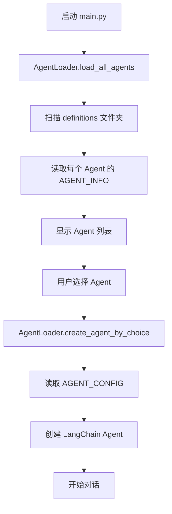

# 📁 项目结构说明

## 重构后的目录结构

```
line/
├── src/
│   ├── agents/                      # Agent 模块
│   │   ├── __init__.py             # 模块导出
│   │   ├── agent_factory.py        # 原有的 Agent 工厂（保留兼容）
│   │   ├── loader.py               # 🆕 Agent 加载器
│   │   └── definitions/            # 🆕 Agent 定义文件夹
│   │       ├── __init__.py         # Agent 注册中心
│   │       ├── _template.py        # Agent 模板
│   │       ├── HOW_TO_ADD_AGENT.md # 添加 Agent 指南
│   │       ├── basic_agent.py      # 基础 Agent 定义
│   │       ├── advanced_agent.py   # 高级 Agent 定义
│   │       └── custom_agent.py     # 自定义 Agent 定义
│   │
│   ├── skills/                      # 技能模块
│   │   ├── __init__.py
│   │   ├── basic_skills.py
│   │   └── advanced_skills.py
│   │
│   ├── utils/
│   └── config.py
│
├── main.py                          # 🔄 重构后的主程序
├── run_interactive.sh               # 启动脚本
├── INTERACTIVE_GUIDE.md             # 使用指南
└── requirements.txt

```

## 🎯 核心组件说明

### 1. Agent Definitions（Agent 定义）

**位置**: `src/agents/definitions/`

**作用**: 存放所有预定义的 Agent 配置

**文件格式**:
```python
# Agent 元数据
AGENT_INFO = {
    "id": "agent_id",
    "name": "Agent 名称",
    "description": "描述",
    "icon": "🤖",
    "version": "1.0.0",
    "author": "作者",
}

# Agent 配置
AGENT_CONFIG = {
    "tools": [...],
    "system_prompt": "...",
}

def get_agent_info():
    return AGENT_INFO

def get_agent_config():
    return AGENT_CONFIG
```

### 2. Agent Loader（Agent 加载器）

**位置**: `src/agents/loader.py`

**作用**: 动态加载和创建 Agent

**主要方法**:
- `load_all_agents()` - 加载所有 Agent 信息
- `create_agent_by_choice(choice)` - 根据选择创建 Agent
- `create_agent_by_id(agent_id)` - 根据 ID 创建 Agent
- `get_agent_info_by_choice(choice)` - 获取 Agent 信息

### 3. Main Program（主程序）

**位置**: `main.py`

**作用**: 交互式界面，使用 AgentLoader 动态加载 Agent

**特点**:
- 不再硬编码 Agent 列表
- 自动从 definitions 文件夹读取
- 支持动态添加新 Agent

## 🔄 工作流程



## ✨ 新增功能

### 1. 动态 Agent 加载
- ✅ Agent 定义与代码分离
- ✅ 添加新 Agent 无需修改主程序
- ✅ Agent 元数据完整（版本、作者等）

### 2. 标准化的 Agent 定义
- ✅ 统一的文件格式
- ✅ 模板文件方便创建
- ✅ 详细的添加指南

### 3. 灵活的技能配置
- ✅ 可自由组合技能
- ✅ 支持导入单个或多个技能
- ✅ 可动态调整技能列表

## 📝 使用方式

### 查看所有 Agent
```bash
python main.py
# 会自动显示 definitions 文件夹中的所有 Agent
```

### 添加新 Agent
1. 复制模板：`cp src/agents/definitions/_template.py src/agents/definitions/my_agent.py`
2. 编辑 `my_agent.py` 定义 Agent
3. 在 `__init__.py` 中注册
4. 运行 `python main.py` 即可看到新 Agent

### 编程方式使用
```python
from src.agents.loader import AgentLoader

# 方式1: 通过 ID 创建
agent = AgentLoader.create_agent_by_id("basic")

# 方式2: 通过选择创建
agent = AgentLoader.create_agent_by_choice("1")

# 获取所有 Agent 信息
agents = AgentLoader.load_all_agents()
```

## 🎨 扩展性

### 添加新的 Agent 类型

只需3步：

1. **创建定义文件** - `src/agents/definitions/expert_agent.py`
2. **注册 Agent** - 在 `__init__.py` 中添加到 `AVAILABLE_AGENTS`
3. **完成** - 自动在程序中可用

### 自定义加载逻辑

修改 `loader.py` 可以实现：
- 从数据库加载 Agent
- 从配置文件加载 Agent
- 根据权限过滤 Agent
- 动态扫描文件夹

## 🔄 与旧版的兼容性

- ✅ 保留了 `AgentFactory` 类
- ✅ 旧代码仍然可以使用
- ✅ 新旧方式可以并存

## 📚 相关文档

- [添加 Agent 指南](src/agents/definitions/HOW_TO_ADD_AGENT.md)
- [交互式使用指南](INTERACTIVE_GUIDE.md)
- [Agent 模板](src/agents/definitions/_template.py)

## 🎯 优势总结

| 特性 | 旧版本 | 新版本 |
|------|--------|--------|
| Agent 定义 | 硬编码在 main.py | 独立的定义文件 |
| 添加新 Agent | 需修改多处代码 | 只需添加定义文件 |
| Agent 信息 | 简单的字典 | 完整的元数据 |
| 可维护性 | 低 | 高 |
| 扩展性 | 差 | 优秀 |
| 代码复用 | 无 | 高 |
